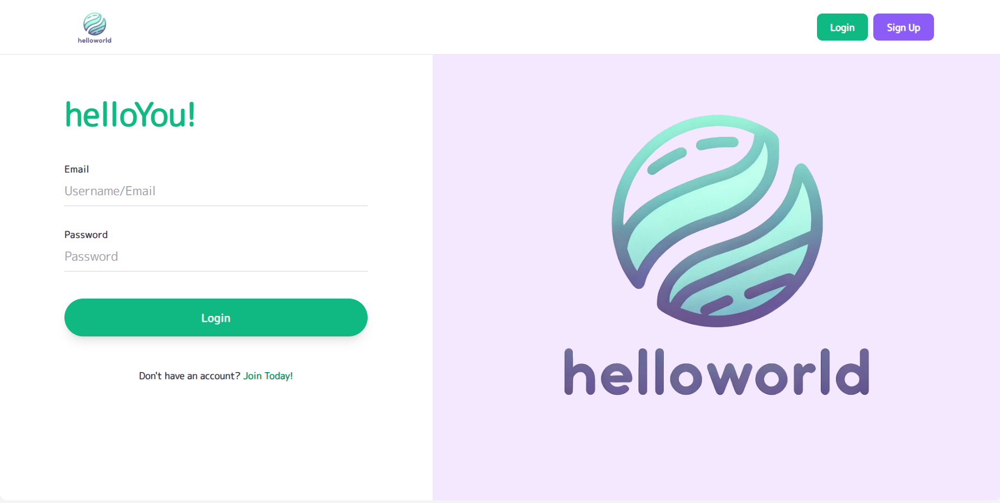
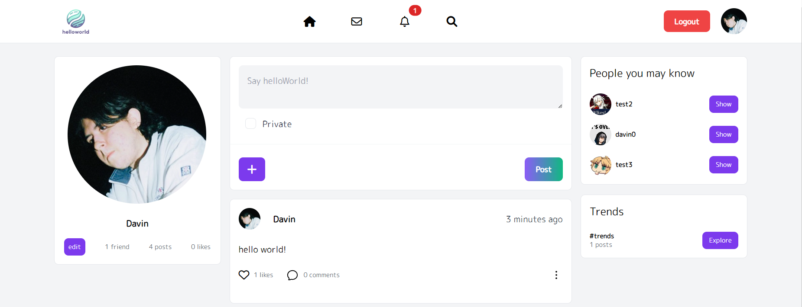
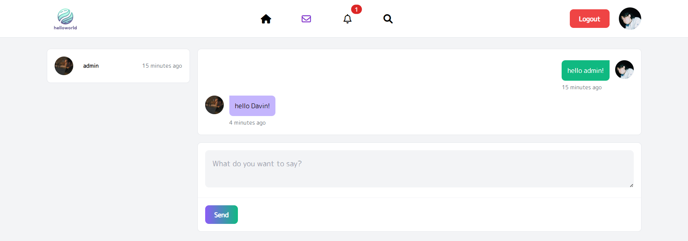

# helloWorld

helloWorld is a simple social network platform. The frontend is built with Vite and Vue, and the backend is built with Django and SQLite. This is my first attempt at building a social network platform, so there is a lot of room for improvement and adding new features.

## Features

- **Unique User Profiles**: Customize your profile to express your identity.
- **User Posts**: Share your thoughts, photos, and more with posts unique to your profile.
- **Interactions**: Like, comment on, and report posts to engage with the community.
- **Post Management**: Delete or set your posts to private, controlling your digital footprint.
- **Friend System**: Add users as friends to build your network.
- **Real-Time Messaging**: Communicate instantly with your friends and connections.
- **Liked Posts Page**: Keep track of the posts you've liked in a dedicated space.
- **Friend Recommendations**: Discover new friends through mutual connections.
- **Trending Hashtags**: Explore and participate in the latest trends.
- **Notifications**: Stay updated with real-time notifications for likes and comments on your posts.
- **Search Functionality**: Find posts and users easily with keyword search.

## Technology Stack

- **Frontend**: Vite, Vue, TypeScript
- **Backend**: Python, Django
- **Database**: SQLite


## Getting Started

To get helloWorld running on your local machine, follow these steps:

### Prerequisites

- Node.js (for Vite and Vue)
- Python (for Django)

### Setup

1. **Clone the repository**

```bash
git clone https://github.com/dvvin/hello-world-social-network.git
```

2. **Start the frontend**

```bash
cd helloworld_frontend
npm install
npm run dev
```

3. **Start the backend**

```bash
cd helloworld_backend
pip install -r requirements.txt
python manage.py migrate
python manage.py runserver
```

## Screenshots

1. **Login page**


2. **Profile page**


3. **Messaging page**

